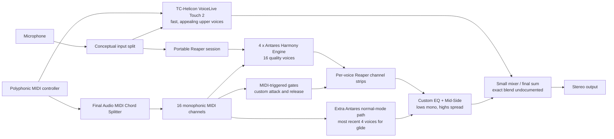

# Bloomberg Harmonizer Stack: Emulation North Star

Updated: 2026-07-21

This document is the system-level roadmap for emulating the Jacob Collier
harmonizer described by Benjamin Bloomberg. It is intentionally not a claim that
we know the private DSP inside Antares or TC-Helicon. The most important lesson
from the thesis is that the instrument was a carefully voiced stack of imperfect
components, not one secret pitch-shifting algorithm.

> Build an instrument that responds on the TC-Helicon timescale, settles with
> Antares-like quality, articulates each MIDI voice as precisely as a synthesizer,
> and remains simple enough to trust on stage.

The detailed DSP and patent comparison lives in [harmonizer.md](harmonizer.md).
This note is the historical architecture, behavioral target, and implementation
order.

## Evidence key

- **Documented:** Bloomberg states this directly in the thesis.
- **Inference:** A plausible interpretation of the documented routing, but not
  disclosed precisely enough to treat as fact.
- **Our emulator:** A current implementation choice or proposed experiment.

Keep these categories separate. In particular, Bloomberg does not publish
Antares source code, TC-Helicon firmware, exact plugin parameters, the parallel
mix level, or an end-to-end latency measurement.

## The north-star architecture

The historical instrument solved five different problems in five different
places:

1. **Immediate feel:** TC-Helicon VoiceLive Touch 2 ran in parallel because its
   low processing latency made upper harmonies feel natural and gave the
   impression of lower latency.
2. **Quality and low-end weight:** Antares Harmony Engine in Reaper sounded
   better and produced convincing bass fundamentals and formants when shifting a
   high input voice downward.
3. **Polyphony:** a Final Audio MIDI Chord Splitter transformed one chord into
   monophonic MIDI channels; four Antares instances supplied 16 voices.
4. **Articulation and orchestration:** every voice returned to its own Reaper
   channel for MIDI-triggered attack/release gates, EQ, panning, and Mid-Side
   processing.
5. **Instrument reliability:** an industrial PC, audio interface, small mixer,
   TC unit, deterministic software image, rugged case, and later custom chassis
   turned a DAW experiment into a stage appliance.

The shortest useful summary is:

```text
fast hardware onset + slower software quality + per-voice musical control
```

That is the organizing principle for our `parallel` backend.

## Documented signal flow

The following is a functional reconstruction. Solid relationships are stated in
the thesis. The exact analog split, gain staging, and summing topology are not
published, so the input and final mixer connections are conceptual.



### Important uncertainty

The thesis says the TC unit was used "in parallel" with the Reaper harmonizer.
It does not say whether its contribution was a fixed blend, manually changed by
register or song, dynamically gated, or otherwise processed. Our onset-triggered
handoff is a clean experiment, not a recovered historical parameter.

## Historical development

### 1. Product comparison

**Documented, section 4.1, printed pages 161-162:**

- Jacob brought a `TC Helicon VoiceLive Touch 2` with a MIDI-controlled vocoder
  mode.
- The TC had low processing latency and attractive high voices/harmonies.
- Its low voices were weak, it provided only four voices, and its interface was
  cumbersome.
- Software products from Antares, iZotope, and others had more latency but
  better sound.
- Antares was the favorite, especially for downward shifts: Bloomberg describes
  a loud fundamental and realistic formant even when the singer supplied a high
  source note.

This establishes the core tradeoff. "Fast" and "good" were separate signal
paths before they became one playable instrument.

### 2. Sixteen-voice Reaper prototype

**Documented, section 4.1, printed pages 162-163:**

- Antares could treat each MIDI channel as a monophonic voice.
- Final Audio's chord-splitter script assigned chord tones to separate channels.
- Four plugin instances mapped groups of four channels to produce 16 voices.
- The first prototype was assembled in one afternoon from existing software.

The musical novelty was therefore not custom low-level DSP. It was the routing,
voice allocation, voicing, and Jacob's technique.

### 3. Per-voice articulation

**Documented:** the stock plugin releases lasted hundreds of milliseconds, and
Jacob could play faster than the instrument could articulate. Bloomberg routed
each audio voice to a separate channel strip and combined its audio with the
corresponding MIDI to drive a custom gate.

This is a critical design rule:

```text
MIDI decides when a harmony voice speaks; detected F0 decides how it is shifted.
```

The pitch shifter should not own note duration. A separate MIDI envelope must
make note-on, note-off, retrigger, sustain, and voice stealing deterministic.

### 4. Register-dependent mix

**Documented:** Bloomberg added custom EQ and Mid-Side processing so low voices
were mono while high voices were panned left and right.

This is more than pleasant stereo decoration:

- centered bass preserves weight and avoids unstable low-frequency stereo
- alternating or distributed upper voices make dense chords legible
- per-voice EQ can prevent 16 shifted copies from accumulating mud or harshness

The exact EQ curves and pan law are not published.

### 5. Glide as a separate behavior

**Documented:** polyphonic-to-monophonic splitting made Antares Glide difficult.
The workaround was another Antares instance in normal mode operating on the
most recent four voices, so portamento occurred between recent notes.

Do not force all 16 allocator voices to glide. A small recency-based glide layer
is closer to the documented design and easier to control musically.

### 6. Touring appliance

**Documented, section 4.3, printed page 166:**

- a fanless Portwell industrial PC ran a portable Reaper installation
- the case also held an audio interface, small mixer, and TC-Helicon
- the TC ran in parallel for perceived latency and its appealing upper voices
- Deep Freeze restored the computer to a known state every boot
- everything fit in a Pelican 1510 carry-on case
- normal operation was reduced to microphone, power, outputs, and boot

Bloomberg's metaphor was an appliance that behaves the same way on every start.
That operational simplicity is part of the instrument, not release engineering
to consider later.

### 7. Hardware 2.0 and Bloomberg's retrospective

**Documented, section 4.6, printed pages 180-183:**

- road shock exposed weak connectors and the Portwell power-supply interface
- the rebuilt chassis added strain relief, a patch panel, transformer-isolated
  I/O, centralized power, and a modified TC unit controlled mainly over MIDI
- the replacement Neousys industrial PC was a quad 3.4 GHz i7 with 16 GB RAM
- Bloomberg says latency remained the largest struggle, partly because accurate
  low-frequency FFT analysis needs longer input
- for a redesign he would consider low-latency DSP or FPGA and a purpose-built
  vocoder algorithm
- he explicitly lists Mid-Side processing, custom envelopes, sustain, glide,
  freeze pitch shifting, and EQ as pieces that would need to be rebuilt

He also emphasizes durability, remote control, configuration flexibility,
power compatibility, and song-specific behavior. A sonically accurate emulator
that is fragile or awkward is not an accurate emulation of the instrument.

## Why the stack feels better than one shifter

### Perceptual onset can arrive before full quality

**Documented fact:** TC was retained in parallel to create the impression of
lower latency.

**Inference:** the ear can use a quieter, earlier harmonic onset as the timing
cue while a fuller delayed path supplies sustained tone. The two paths do not
need identical timbre to improve perceived immediacy. They do need compatible
pitch, articulation, gain, and phase behavior.

This does not make the later path physically faster. It separates two jobs:

- early path: establish pitch, consonant timing, and key-down response
- quality path: carry vowels, formants, bass weight, and the body of held notes

### The bass problem is synthesis, not merely pitch accuracy

Antares distinguished itself by producing a forceful fundamental when shifted
down from a high voice. A shifter can land on the correct MIDI frequency and
still sound thin or robotic because:

- the desired low fundamental was absent or weak in the source
- formant handling makes the apparent vocal tract implausible
- transient and phase coherence degrade across a large ratio
- a global normalization hides low-frequency energy under upper partials

EQ alone cannot reliably create a missing fundamental. Downward voices may need
a register-specific algorithm or reinforcement stage.

### MIDI owns harmony pitch

For this instrument the sung F0 is a control reference, not the desired output
melody. If MIDI note 60 is held, the output target is C4. Vibrato and slow pitch
drift in the sung source should change the required transposition ratio in the
opposite direction, leaving the synthesized note stable at C4.

Unvoiced consonants are different. Bloomberg says the system worked for
whispering and beatboxing, but the thesis does not disclose whether Antares or
TC held the last ratio, bypassed unshifted transients, or used another detector.
That behavior must be determined by listening tests, not attributed to the
historical stack without evidence.

## Behavioral acceptance contract

An emulator is moving toward the Bloomberg instrument when it satisfies all of
these behaviors, not merely when a pitch detector reports the right F0:

| Behavior | Acceptance criterion |
| --- | --- |
| Pitch lock | A held MIDI note remains flat despite sung vibrato; no audible 2 Hz wobble tracks the input. |
| Note articulation | Fast chord changes follow MIDI note-on and note-off without plugin release tails smearing the next voicing. |
| Immediate onset | An audible, correctly pitched onset arrives early enough to anchor key presses; total loopback latency is measured, not guessed from buffer sizes. |
| Sustained quality | The settled vowel is at least as natural as the unchanged Live512 baseline. |
| Downward weight | Octave-down and two-octave-down voices retain a clear target fundamental instead of becoming only dark, phasey upper partials. |
| Consonants | `S`, `T`, `K`, breath, and beatbox transients remain intelligible and rhythmically aligned without inventing a fake F0. |
| Dense chords | Sixteen voices remain bounded in level, distinct in stereo, and free of obvious voice-allocation clicks. |
| Register image | Low voices remain centered; upper voices spread without hollowing the center. |
| Stability | A rehearsal-length run has zero xruns, no unbounded queues, and deterministic recovery after a restart. |
| Usability | One launch restores backend, audio/MIDI devices, mix, and musical controls; performance does not depend on the browser audio engine. |

## Mapping to our current C++ emulator

Status as of 2026-07-21:

| Bloomberg component | Current counterpart | Status |
| --- | --- | --- |
| 16 monophonic harmony voices | Native per-note allocator with 16 independent shifters | Implemented |
| MIDI-controlled duration | Per-voice MIDI envelopes, currently 5 ms attack / 80 ms release | Implemented; needs listening calibration |
| Exact harmony notes | Stable sung F0 drives ratio correction while MIDI defines target pitch | Implemented and regression-tested |
| Antares quality path | Rubber Band LiveShifter, 512-sample blocks, formant preservation | Best current baseline, not an Antares clone |
| TC immediacy path | Rubber Band R2 short-window path | Experimental surrogate |
| TC + Antares parallel stack | `parallel` backend: R2 at about 23.2 ms beside Live512 at about 68.2 ms DSP-path arrival | Implemented as an A/B experiment |
| Parallel contribution | Persisted `Immediacy` control, default 25% onset; R2 yields over 30 ms after Live512 arrives | Implemented; historical value unknown |
| Low mono / high stereo | Register-dependent equal-power pan; notes at and below C3 remain centered | Implemented |
| MIDI-aware unvoiced behavior | `TC bypass` and `Hold ratio` modes | Implemented experiments; historical behavior unknown |
| Clear low detector range | aubio lanes accept stable fundamentals down to A1 | Implemented |
| Custom per-voice EQ | No register/interval-specific EQ bank yet | Missing |
| Antares-like bass generation | Live512 only; no dedicated fundamental reinforcement | Major gap |
| Recent-four glide path | Persisted amount/time controls glide each new MIDI target from the previously played note | Functional approximation; not yet the historical separate four-voice lane |
| Sustain / freeze / infinite reverb | Three latch/momentary layers, independent level/transposition, clean release reset, and shared tone control | Implemented with an in-process Freeverb-style surrogate, not the original Ambience plugin |
| Post-harmony effects | Persisted stereo chorus and musical reverb controls | Implemented; defaults remain off |
| Appliance packaging | Native C++ audio server, browser control surface, saved settings, DevHub launch | Functional development rig; not yet touring-grade |

The current `parallel` backend is deliberately additive. The Live512 quality
implementation remains available unchanged, and alternative algorithms stay in
separate backend files so experiments cannot silently damage the reference.

## Ranked emulation roadmap

### Priority 0: keep a fixed reference

**Already established:** retain `live512` as the quality baseline and preserve
captured-input replay, pitch fixtures, vibrato-lock tests, unvoiced-mode renders,
and backend latency reports.

Do not judge a new algorithm only while singing live. Record the microphone and
MIDI once, then render every backend from the identical event stream.

**Exit condition:** a candidate can be compared against Live512 using the same
audio, MIDI, settings, level matching, and latency alignment.

### Priority 1: tune parallel onset as an onset layer

**Implemented experiment:** R2 arrives around 23.2 ms and Live512 around 68.2 ms
in the DSP path. Vocal onsets, source-pitch jumps, and new MIDI voices trigger
the R2 contribution; it yields to Live512 over 30 ms after the quality arrival.
The R2 source-F0 control uses a robust timestamped pitch+slope tracker with an
empirically measured `-1184`-sample control offset. Live512 keeps the empirically
superior previous-hop control because it acts on buffered audio. A 2/4/6 Hz,
multi-depth, multi-interval matrix disabled the parallel path's old sign-blind
flutter compensation; the standalone Live512 reference remains unchanged.

Next experiments:

1. Sweep 0%, 10%, 15%, 25%, and 40% onset contribution using blind,
   loudness-matched renders.
2. Measure physical microphone-to-headphone loopback latency for both arrivals;
   PortAudio device latency is now reported separately.
3. Check phase/comb filtering at unison and small intervals before increasing
   the early blend.

The automated regression currently measures the R2 output 38 ms ahead of
parallel quality-only and verifies that the settled output is identical to that
path. A live 16-voice run measured a 3.47 ms worst DSP batch, a 448-frame maximum
worker queue, and zero xruns over the 15-second stress interval.

**Exit condition:** note onset feels earlier than Live512 alone while the held
vowel is not detectably worse and the 16-voice live run remains xrun-free.

### Priority 2: make the parallel blend register-aware

This follows the strongest documented clue: TC excelled at highs; Antares
excelled at lows.

Proposed policy:

- upward and high-register voices: allow more early-path contribution
- unison and small shifts: use enough early path to anchor timing, then settle
- octave-down and two-octave-down voices: favor the quality path heavily
- consonant frames: route according to the selected unvoiced mode, not a bogus
  pitch estimate

Use smooth weights based on target register and shift interval so chord tones do
not jump in level when crossing a boundary.

**Exit condition:** high chords gain immediacy without making low voices thinner
than Live512.

### Priority 3: solve downward fundamental weight

Do not begin by replacing the working backend. Add isolated candidates and keep
the original path selectable.

Promising experiments, in order:

1. register-specific EQ and dynamic low-shelf compensation
2. phase-locked fundamental reinforcement derived from target MIDI and the
   source envelope
3. a residual/harmonic source-filter voice mixed under Live512 only for large
   downward intervals
4. a dedicated TD-PSOLA or Lent-style backend for voiced material
5. a custom low-latency vocoder only after the simpler experiments establish
   what the missing component actually is

The reinforcement oscillator must follow vocal amplitude and articulation; a
constant sine under every note will sound like a synthesizer rather than a voice.

**Exit condition:** octave-down fundamentals are stronger and subjectively more
vocal than Live512 without buzzing through consonants or leaking after note-off.

### Priority 4: reproduce the per-voice channel strip

Add a compact parameter model indexed by target register and shift interval:

- attack and release
- high-pass / low-shelf / presence shaping
- output trim
- stereo position and width
- optional de-essing or transient emphasis

Start with three register bands rather than 16 bespoke EQs. The goal is a clear
musical result, not a visual imitation of a Reaper session.

**Exit condition:** 8-16 note chords stay intelligible and level-consistent
across inversions, with bass centered and highs spacious.

### Priority 5: refine recent-note glide

**Implemented approximation:** every native backend can ease a newly played
target from the previously played MIDI note. `Glide amount` controls how much
of the interval is traversed and `Glide time` controls its duration. Strict
non-glide allocation remains the default.

The remaining historical gap is architectural: add a separate layer limited to
the four most recently assigned notes, matching the documented Antares
workaround, so old chord tones remain fixed while connected lines glide.

**Exit condition:** connected lines glide predictably without causing old held
chord tones to retune or stealing the wrong voice.

### Priority 6: restore the surrounding instrument behaviors

Implemented performance layer:

- three freeze layers with latch and momentary UI modes
- infinite-reverb-style hold with a click-free reset between captures
- continuous per-layer freeze level and `-24..+24` semitone transposition
- a shared open/closed freeze tone control
- optional chorus and musical reverb after the harmony bus

Still required:

- song/preset recall without changing the core audio route
- remote control and deterministic state restoration

The historical Ambience and superpitch implementations are not embedded. The
current DSP is a behaviorally similar, dependency-free surrogate and should be
judged by listening and repeatable captures rather than by name.

These are composition and performance layers, not substitutes for a stable
harmonizer core.

### Priority 7: make it an appliance

For public or rehearsal deployment:

- package pinned DSP dependencies per operating system
- use one launcher and one local URL
- validate selected input, output, and MIDI devices at startup
- preserve settings independently of server restarts
- provide a clear audio-safe failure state instead of feedback or full-scale
  noise
- run rehearsal-length soak tests
- prefer robust, strain-relieved audio/MIDI connections for a permanent rig

The historical standard is "plug in mic and power, connect outputs, turn it on."

## Required A/B matrix

Every meaningful DSP change should render this small matrix before live testing:

| Dimension | Cases |
| --- | --- |
| Backend | Live512; Parallel 10%; Parallel 25%; candidate |
| Interval | unison; +7; +12; -12; -24 semitones |
| Target register | bass; mid; high |
| Input | steady vowel; slow 2 Hz vibrato; fast note change; vowel-to-`S`; breath/whisper |
| Chord size | 1; 4; 8; 16 voices |
| Measurement | early arrival; settled arrival; target pitch error; low-band energy; peak/RMS; xruns |

For the Collier-inspired freeze controls, `make test-collier-features` runs a
Vocadito matrix through the exact native renderer. It verifies a nonzero hold
during digital silence, measures relative interval accuracy with an FFT, and
checks that the open/closed control lowers spectral centroid. The current
major-third, fourth, fifth, and octave cases are within 5.2-15.7 cents relative
to the untransposed freeze.

Three additional audits now cover the largest former blind spots:

- `make test-polyphonic` measures each requested fundamental in one-, four-,
  eight-, and sixteen-voice renders. Harmonic-masked notes are labeled, then
  covered independently in upper-register eight-note chords.
- `make test-formants` compares low-quefrency cepstral envelopes and F1-F3 for
  deterministic `/a/`, `/i/`, and `/u/` signals over `-24..+24` semitones.
  This remains a strict quality audit, not a snapshot test that normalizes
  current defects into success.
- `make test-roundtrip-latency` validates waveform and coded-envelope
  correlators. The live probe reports P50/P95/P99, jitter, normalized
  correlation, xruns, and PortAudio's device-latency estimates.

The first Live512 baseline found all 16 requested chord tones in the broad
stress chord, but an independent high-register chord retained only five of
eight measurable fundamentals above C6. The strict formant baseline passed
four of fifteen cases; downward shifts produced the largest full-envelope
errors. A real BlackHole 48 kHz loop measured 24.000 ms in waveform mode and
24.007 ms in envelope mode, matching PortAudio's reported 10.667 ms input plus
13.333 ms output with zero jitter and zero xruns. This validates the measuring
tool, not the harmonizer's full physical mic-to-headphone latency; that still
requires routing the probe through the running app.

Listening tests should be latency-aligned and loudness-matched when judging
quality. They should remain unaligned when judging perceived responsiveness.
Both views answer different questions.

## Things the thesis does not tell us

- Antares Harmony Engine's internal detector or synthesis algorithm
- TC-Helicon's internal detector or synthesis algorithm
- exact plugin versions, presets, quality modes, or buffer sizes
- exact attack/release values for the per-voice gates
- exact EQ, Mid-Side, pan, or gain settings
- exact TC/Reaper parallel blend and whether it changed with register or song
- exact treatment of `S`, breath, whisper, and other unvoiced material
- exact total microphone-to-speaker latency
- whether later commercial Antares or TC products reproduce the same behavior

Treat demonstrations and patents as additional evidence, not permission to fill
these gaps with confident guesses.

## Design decisions to preserve

1. Keep backends interchangeable and never destroy the best-known reference to
   test a speculative algorithm.
2. Let MIDI define harmony pitch and articulation; let F0 estimation provide the
   transposition control signal.
3. Separate onset latency from sustained quality instead of demanding one path
   optimize both immediately.
4. Tune by register and interval because the historical components had different
   strengths.
5. Judge the complete playable instrument: DSP, envelopes, stereo image,
   reliability, recall, and setup time.
6. Use repeatable captures before drawing conclusions from a live microphone.

## Primary source map

Source thesis:

- Benjamin Bloomberg, *Making Musical Magic Live: Inventing modern production
  technology for human-centric music performance* (MIT PhD thesis, 2020)
- Local PDF: `Benjamin_Bloomberg_Making_Musical_Magic_Live_2020.pdf`
  (research copy, not distributed)
- Local text extraction:
  `Benjamin_Bloomberg_Making_Musical_Magic_Live_2020.txt`
  (not distributed)
- MIT record: <https://dspace.mit.edu/handle/1721.1/129893>

Most relevant thesis sections and extracted-text anchors:

- `4.1 The Beginning of the Harmonizer` - TC/Antares comparison, 16 voices,
  MIDI gates, EQ/Mid-Side, and recent-four glide; printed pages 161-163
- `4.3 Refining the Harmonizer for Touring` - Portwell/Reaper appliance,
  TC in parallel, Deep Freeze, and Pelican case; printed page 166 onward
- `4.6 Harmonizer Hardware 2.0` - ruggedized rebuild, Neousys PC, latency,
  FPGA/vocoder redesign, and complete-instrument requirements; printed pages
  180-183
- `4.10.1 Connectors` - USB failure modes and migration toward DIN MIDI;
  printed pages 191-192
- `4.10.2 Redundancy and Notable Failures` - stage failures and redundancy;
  printed pages 192-194

Search the local text for these exact phrases when checking this note:

```text
The Beginning of the Harmonizer
found a script by Final Audio
MIDI-triggered gate
low voices were mono
only on the last four voices
chose to use, in parallel
behave like a toaster
Harmonizer Hardware 2.0
our biggest struggle with the current version is the system latency
```
